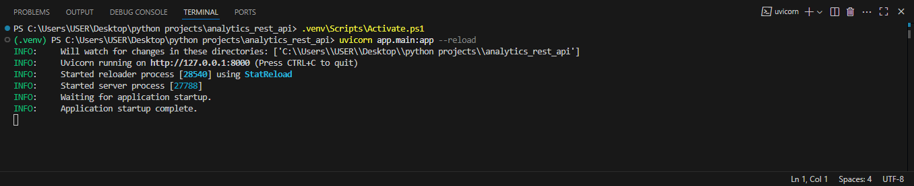
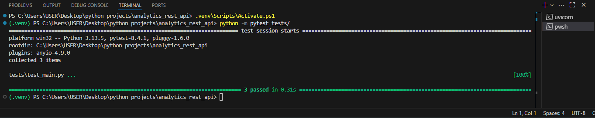

# Analytics REST API

This is a **FastAPI-based REST API** project with automated testing, and CI via GitHub Actions.

## **Features**
- Endpoint `/hello` returns a greeting message.
- Endpoint `/predict?name=YourName` simulates a prediction response.
- Automated tests with `pytest`.

## **How to run locally**
```plaintext
pip install -r requirements.txt
uvicorn app.main:app --reload
Open http://127.0.0.1:8000/hello
```
## Run tests
```
pytest tests/
```
## CI Pipeline
Every push to main triggers GitHub Actions:

- Installs dependencies.

- Runs tests (pytest).

- Reports results in the Actions tab.
---
## Screenshots
Running Server:

Tests passed:

